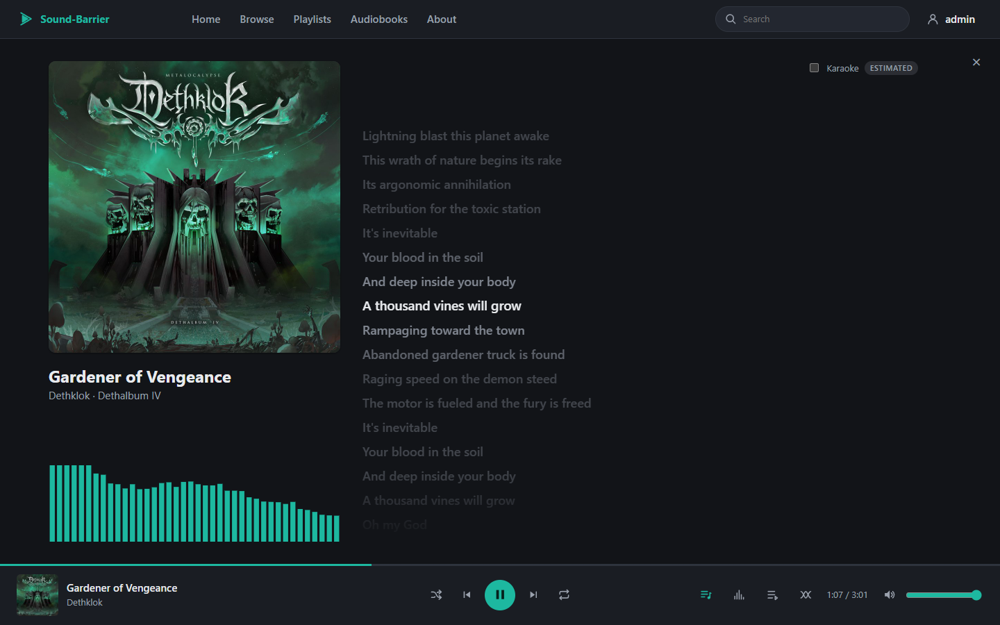
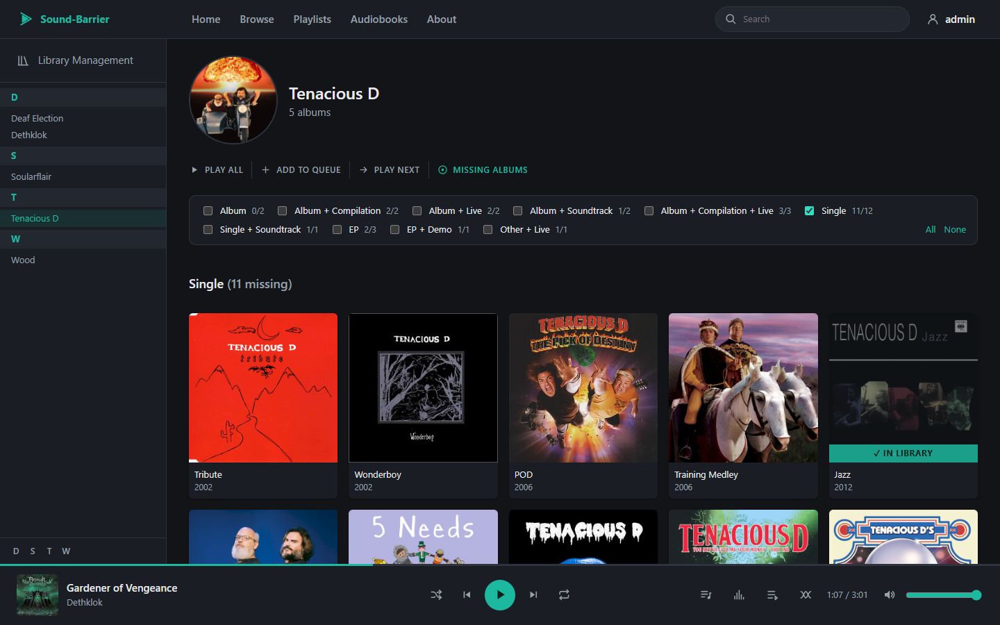
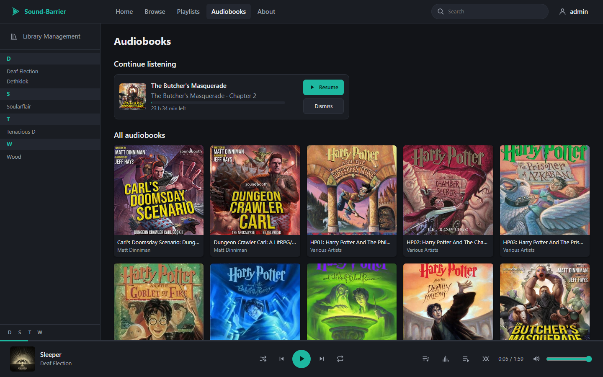
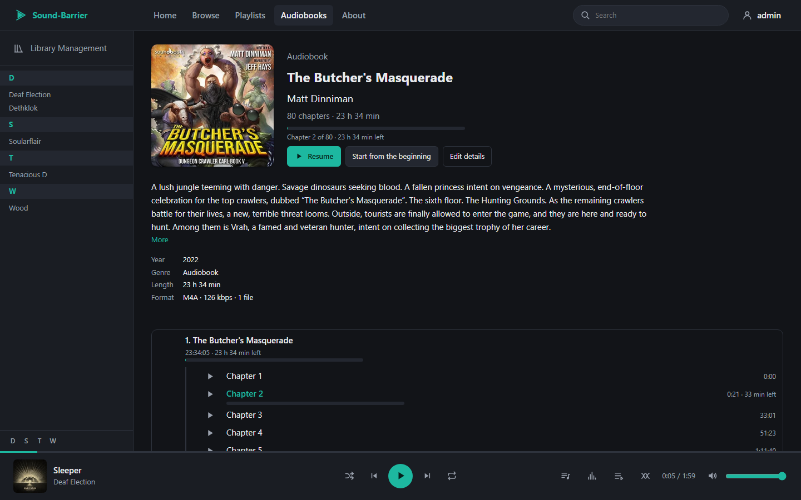

#  Sound-Barrier

A self-hosted music streaming server that speaks the **Subsonic API**, with a modern web
player and built-in library management powered by [beets](https://beets.io). Podcasts
and audiobooks have their own library, kept apart from the music.

Point it at your music folder and use any Subsonic / Airsonic / Navidrome client
(DSub, Symfonium, Feishin, play:Sub, …) or the included web UI. New music is imported,
tagged against MusicBrainz and filed into your library from the browser: no `beet`
command line, no config files to edit. Audiobooks and podcasts go through their own
review, helped by Audible, MusicBrainz, Open Library and iTunes.

> **Status:** personal project, in active development. It already runs daily as a
> replacement for a Subsonic instance; what is left is tracked in [ROADMAP.md](ROADMAP.md).

## Screenshots

| | |
|---|---|
|  |  |
| **Home**: random picks, recently added / most / recently played, the artist index | **Album**: tracks, queue actions, playlists, tag editor |
|  |  |
| **Now playing**: synced lyrics following the song, visualizer | **Missing albums**: the artist's MusicBrainz discography against the library |
|  |  |
| **Audiobooks**: continue listening, then every book | **A book**: details, progress, the chapters inside the file |
|  |  |
| **Import review**: MusicBrainz candidates with track-by-track differences | **Player**: the queue panel, with crossfade, shuffle and repeat |

## Features

**Subsonic server**
- [Subsonic API](http://www.subsonic.org/pages/api.jsp) 1.16.1 with
  [OpenSubsonic](https://opensubsonic.netlify.app/) extensions (API keys, form POST,
  song lyrics, index-based play queue).
- XML, JSON and JSONP responses; token, password and API key authentication.
- Streaming with HTTP range requests (seeking), resized and cached cover art.
- Browsing by artist / album (ID3) and by folder, album lists, search, random songs,
  genres, stars and ratings, scrobbling, now playing, playlists, the apps' play queue,
  users and roles.
- Artist and album information, top songs and similar songs ("instant mix") from Last.fm;
  artist pictures from Deezer or fanart.tv.
- Lyrics: `.lrc` files, the files' tags, then [LRCLIB](https://lrclib.net) (cached).
- Podcasts and audiobooks through the podcast API (`getPodcasts`, `getNewestPodcasts`,
  `getPodcastEpisode`) and bookmarks, so the apps resume where you stopped.

**Web UI** (React + TypeScript)
- Home, artist and album pages, artist index, search, playlists, cover picker.
- Player with a persistent queue shared by your browsers (drag-and-drop reordering, undo),
  shuffle, repeat, crossfade, OS media keys and keyboard shortcuts (Space, ← / →).
- **Now playing**: big cover, synced lyrics following the song (smooth scrolling, optional
  karaoke sweep, word by word when the lyrics have it) and a frequency visualizer.
- Artist pages: "Play all", and the **missing albums** of the artist's MusicBrainz
  discography, with search links to find them (configurable, GET or POST).
- **Podcasts** and **Audiobooks** pages: continue listening, progress and resume; series
  in reading order; a book's description, narrator and series; chapters inside a file
  (M4B) listed and skippable; playback speed 1× to 2×, −15 s / +30 s and "Pause at end of
  chapter". Admins edit a book's details and chapters (Audible's chapter list on demand).
- Phones: an installable home-screen app (Android, iPhone), a layout for small screens,
  lock-screen controls.
- Light / dark themes with several accent colors.
- Admin settings: library folders, scan progress and schedule, user management, external
  services, album search links, transcript workers.

**Library management** (admins)
- Import from configured folders: albums are matched against MusicBrainz by beets,
  strong matches can be applied automatically, the rest wait for review
  (pick a candidate, search by artist / album or release id, import as-is, skip).
  Folders already in the library are flagged in the import browser.
- **Audiobook and podcast imports** (folders or single files): one review card per book /
  show, prefilled from the tags and folder names, with candidates from Audible,
  MusicBrainz (chapter titles from the matching edition), Open Library and iTunes; then one
  folder per book, files renamed and retagged, cover saved. Folders that look like
  audiobooks or podcasts are recognized.
- Tag editor (albums and tracks, written into the files), covers fetched and embedded,
  duplicate detection against the whole library, optional FLAC → MP3 conversion at
  import time (ffmpeg).
- **New releases**: recent and upcoming releases of your artists that the library does
  not have, refreshed daily in the background.
- Adopt existing library albums into beets, scheduled clean-ups, delete albums, songs,
  audiobooks and podcasts.

**Transcripts** (podcasts and audiobooks)
- Speech to text with Whisper on a PC with an NVIDIA GPU: the companion app
  [`transcriber/`](transcriber/README.md) signs in with a worker token, takes the files that
  have no text and sends it back; shown like synced lyrics, also written as `.lrc` files.

**Deployment**
- A single Docker image (backend + web UI + ffmpeg) on one port, next to PostgreSQL.
- Runs as an unprivileged user; migrations applied automatically on start.
- Login throttling; API keys stored encrypted.

## Tech stack

| Part | Technologies |
|---|---|
| Backend | Python 3.12+, FastAPI, SQLAlchemy, Alembic, PostgreSQL, mutagen, beets |
| Web UI | React, TypeScript, Vite, Less, Vitest |
| Tooling | ruff, pyright, pytest + Testcontainers, Docker |

Design notes (layers, database schema, scanner, library management):
[ARCHITECTURE.md](ARCHITECTURE.md). Component docs: [backend/README.md](backend/README.md),
[frontend/README.md](frontend/README.md).

## Quick start (local development)

Requirements: Docker Desktop, Python 3.12+, Node.js. On Windows, run it from Git Bash.

```bash
./dev.sh          # sets up what is missing, starts Postgres + backend + web UI (Ctrl+C to stop)
./dev.sh down     # stops the Postgres container
```

Then open http://localhost:5173 and sign in with `admin` / `admin` (created on first start;
change it with `backend/.venv/Scripts/sound-barrier set-password admin`).
Subsonic clients connect to `http://localhost:4040`.

On first run the script creates `backend/.venv`, installs the dependencies, creates
`backend/.env` with a new secret key, applies the database migrations and registers
`./music` as a library folder if it exists. Later runs only redo what changed.

## Running on a server (Docker)

One image holds the backend, the web UI and ffmpeg; Postgres runs next to it.

### From the pre-built image (Docker Hub)

The image is published on Docker Hub:
[`dontpanic57/sound-barrier`](https://hub.docker.com/r/dontpanic57/sound-barrier)
(`latest`, or a version such as `1.0.0`; linux/amd64). No need to clone the repository:

```bash
mkdir sound-barrier && cd sound-barrier
curl -fsSL -o docker-compose.yml https://raw.githubusercontent.com/PierreAdam/sound-barrier/master/docker/docker-compose.yml
curl -fsSL -o .env https://raw.githubusercontent.com/PierreAdam/sound-barrier/master/docker/.env.example
# edit .env: POSTGRES_PASSWORD, MUSIC_DIR, IMPORT_DIR, PUID / PGID, TZ
docker compose up -d
```

Updating: `docker compose pull && docker compose up -d` (migrations are applied on
start). To stay on a version, set `SOUND_BARRIER_VERSION=1.0.0` in `.env`.

### From the sources

```bash
cp docker/.env.example docker/.env      # set POSTGRES_PASSWORD, MUSIC_DIR, IMPORT_DIR, PUID/PGID, TZ
# in docker/docker-compose.yml, uncomment `build: ..`
docker compose -f docker/docker-compose.yml up -d --build
```

### Then

Open `http://<server>:4040` (web UI and Subsonic clients on the same port), sign in with
`admin` / `admin` and **change the password**.

| Mount | Purpose |
|---|---|
| `/music` | the library (read-write: imports and deletion) |
| `/podcasts` | podcasts, optional (`PODCASTS_DIR`; turn them on in Settings → Library) |
| `/audiobooks` | audiobooks, optional (`AUDIOBOOKS_DIR`; same) |
| `/import` | import root folder, e.g. your downloads (read-only is enough: imports copy) |
| `/beets` | beets configuration and database |
| `/data` | secret key, caches, import staging |

The secret key is generated into `/data/secret.key` on first start: back it up together
with the database. Behind a reverse proxy, set `FORWARDED_ALLOW_IPS` so HTTPS is detected.

### Deploying a new version

`./deploy.sh` builds the image locally, pushes it to Docker Hub (`latest` plus a dated
tag), then over SSH pulls it on the server, restarts the application container, waits
until it is healthy and checks the public URL. Settings: `deploy.env` (copy
`deploy.env.example`). `--check` runs the backend and frontend checks first;
`--no-build` only redeploys.

## Development

From `backend/`:

```bash
.venv/Scripts/ruff format . && .venv/Scripts/ruff check --fix .
.venv/Scripts/pyright
.venv/Scripts/pytest            # needs Docker running (Postgres via Testcontainers)
```

From `frontend/`:

```bash
npm run typecheck && npm test && npm run build
```

## License

[MIT](LICENSE)

Sound-Barrier's own source code is MIT-licensed. Its third-party dependencies keep their own
licenses. Two runtime dependencies, [mutagen](https://github.com/quodlibet/mutagen) and
[Unidecode](https://pypi.org/project/Unidecode/) (via beets), are GPL-2.0-or-later, so
distributed builds that bundle them, such as the Docker image, are also subject to their terms.
The Docker image also ships [ffmpeg](https://ffmpeg.org/legal.html), which runs as a separate
program under its own license.
