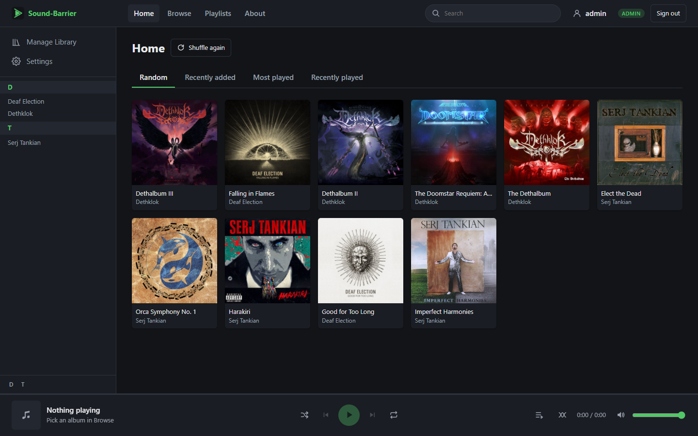
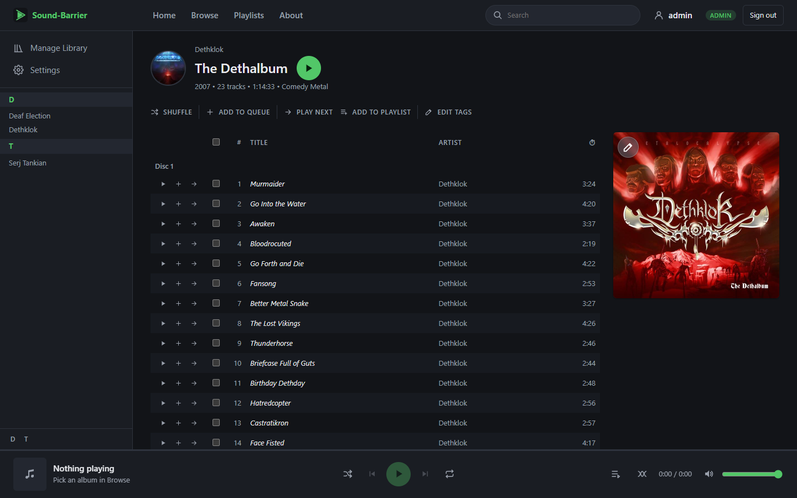
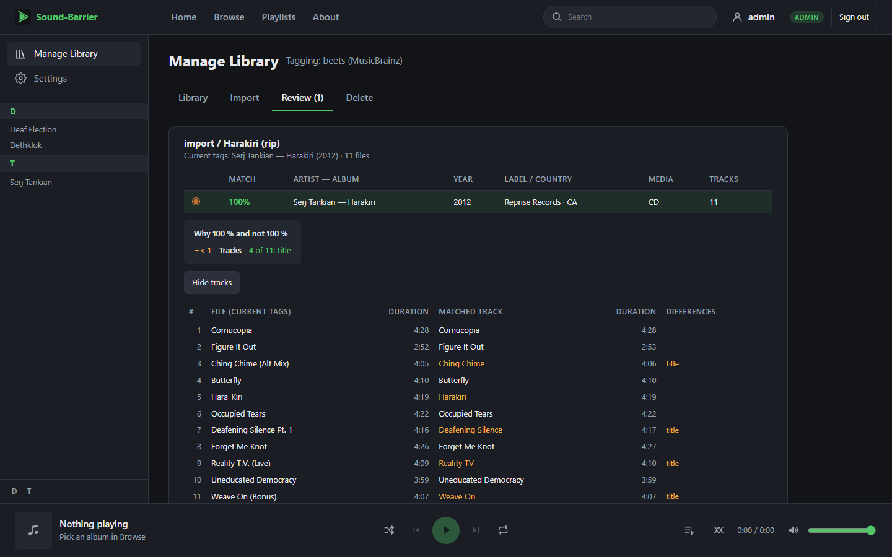
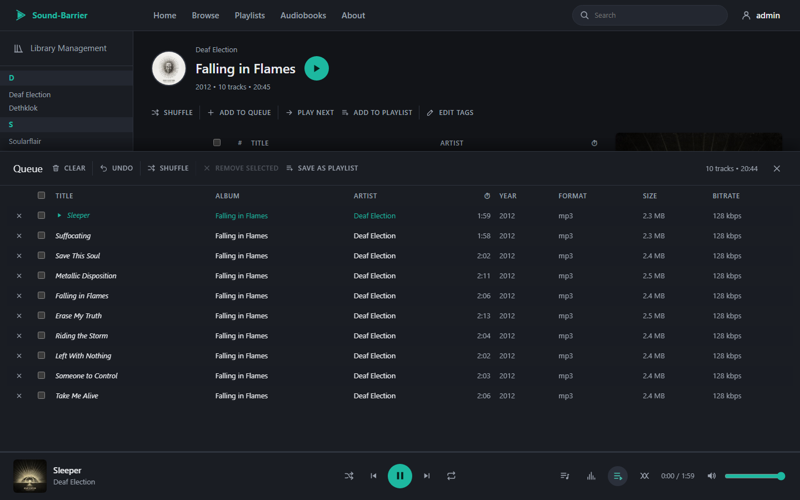

#  Sound-Barrier

A self-hosted music streaming server that speaks the **Subsonic API**, with a modern web
player and built-in library management powered by [beets](https://beets.io).

Point it at your music folder and use any Subsonic / Airsonic / Navidrome client
(DSub, Symfonium, Feishin, play:Sub, …) or the included web UI. New music is imported,
tagged against MusicBrainz and filed into your library from the browser: no `beet`
command line, no config files to edit.

> **Status:** personal project, in active development. It already runs daily as a
> replacement for a Subsonic instance; what is left is tracked in [ROADMAP.md](ROADMAP.md).

## Screenshots

| | |
|---|---|
|  |  |
| **Home**: random picks, recently added / played, the artist index | **Album**: tracks, actions, cover picker |
|  |  |
| **Import review**: MusicBrainz candidates with track-by-track differences | **Player**: the queue panel, with crossfade, shuffle and repeat |

## Features

**Subsonic server**
- [Subsonic API](http://www.subsonic.org/pages/api.jsp) 1.16.1 with
  [OpenSubsonic](https://opensubsonic.netlify.app/) extensions (API keys, form POST).
- XML, JSON and JSONP responses; token, password and API key authentication.
- Streaming with HTTP range requests (seeking), resized and cached cover art.
- Browsing by artist / album (ID3), album lists, search, scrobbling, users and roles.
- Artist information and top songs from Last.fm.

**Web UI** (React + TypeScript)
- Home, artist and album pages, artist index, cover picker.
- Player with a persistent queue (drag-and-drop reordering), shuffle, repeat,
  crossfade and OS media keys.
- Light / dark themes with several accent colors.
- Admin settings: library folders, scan progress and schedule, user management.

**Library management** (admins)
- Import from configured folders: albums are matched against MusicBrainz by beets,
  strong matches can be applied automatically, the rest wait for review
  (pick a candidate, search by artist / album or release id, import as-is, skip).
- Covers fetched and embedded, duplicate detection against the whole library,
  optional FLAC → MP3 conversion at import time (ffmpeg).
- Adopt existing library albums into beets, clean up missing entries, delete albums
  and songs.

**Deployment**
- A single Docker image (backend + web UI + ffmpeg) on one port, next to PostgreSQL.
- Runs as an unprivileged user; migrations applied automatically on start.

## Tech stack

| Part | Technologies |
|---|---|
| Backend | Python 3.12+, FastAPI, SQLAlchemy, Alembic, PostgreSQL, mutagen, beets |
| Web UI | React, TypeScript, Vite, Less, Vitest |
| Tooling | ruff, pyright, pytest + Testcontainers, Docker |

Design notes (layers, database schema, scanner, library management):
[ARCHITECTURE.md](ARCHITECTURE.md). Component docs: [backend/README.md](backend/README.md),
[frontend/README.md](frontend/README.md).

## Quick start (local development)

Requirements: Docker Desktop, Python 3.12+, Node.js. On Windows, run it from Git Bash.

```bash
./dev.sh          # sets up what is missing, starts Postgres + backend + web UI (Ctrl+C to stop)
./dev.sh down     # stops the Postgres container
```

Then open http://localhost:5173 and sign in with `admin` / `admin` (created on first start;
change it with `backend/.venv/Scripts/sound-barrier set-password admin`).
Subsonic clients connect to `http://localhost:4040`.

On first run the script creates `backend/.venv`, installs the dependencies, creates
`backend/.env` with a new secret key, applies the database migrations and registers
`./music` as a library folder if it exists. Later runs only redo what changed.

## Running on a server (Docker)

One image holds the backend, the web UI and ffmpeg; Postgres runs next to it.

```bash
cp docker/.env.example docker/.env      # set POSTGRES_PASSWORD, MUSIC_DIR, IMPORT_DIR, PUID/PGID, TZ
docker compose -f docker/docker-compose.yml up -d --build
```

Open `http://<server>:4040` (web UI and Subsonic clients on the same port), sign in with
`admin` / `admin` and **change the password**.

| Mount | Purpose |
|---|---|
| `/music` | the library (read-write: imports and deletion) |
| `/import` | import root folder, e.g. your downloads (read-only is enough: imports copy) |
| `/beets` | beets configuration and database |
| `/data` | secret key, caches, import staging |

The secret key is generated into `/data/secret.key` on first start: back it up together
with the database. Behind a reverse proxy, set `FORWARDED_ALLOW_IPS` so HTTPS is detected.

### Deploying a new version

`./deploy.sh` builds the image locally, pushes it to Docker Hub (`latest` plus a dated
tag), then over SSH pulls it on the server, restarts the application container, waits
until it is healthy and checks the public URL. Settings: `deploy.env` (copy
`deploy.env.example`). `--check` runs the backend and frontend checks first;
`--no-build` only redeploys.

## Development

From `backend/`:

```bash
.venv/Scripts/ruff format . && .venv/Scripts/ruff check --fix .
.venv/Scripts/pyright
.venv/Scripts/pytest            # needs Docker running (Postgres via Testcontainers)
```

From `frontend/`:

```bash
npm run typecheck && npm test && npm run build
```

A [Navidrome](https://www.navidrome.org/) reference server can be started next to it to
compare API responses on the same library: `docker compose --profile reference up navidrome`.

## License

[MIT](LICENSE)

Sound-Barrier's own source code is MIT-licensed. Its third-party dependencies keep their own
licenses. Two runtime dependencies, [mutagen](https://github.com/quodlibet/mutagen) and
[Unidecode](https://pypi.org/project/Unidecode/) (via beets), are GPL-2.0-or-later, so
distributed builds that bundle them, such as the Docker image, are also subject to their terms.
The Docker image also ships [ffmpeg](https://ffmpeg.org/legal.html), which runs as a separate
program under its own license.
